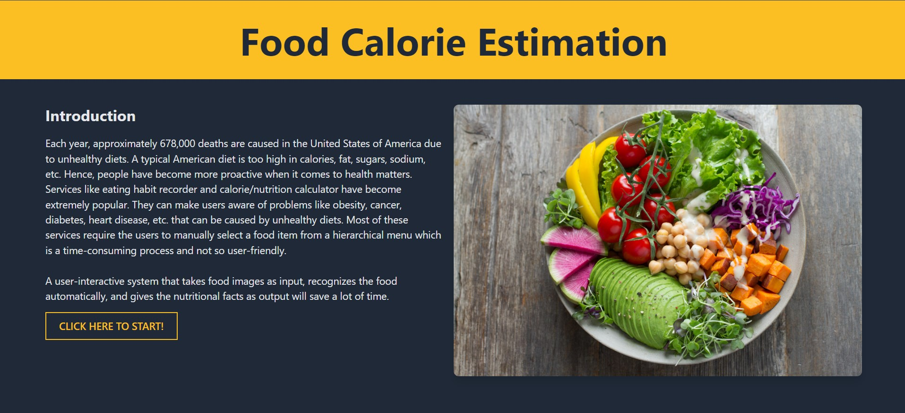

# Food Calorie Estimation

## Table of Contents

- [Food Calorie Estimation](#food-calorie-estimation)
  - [Table of Contents](#table-of-contents)
  - [About the Project](#about-the-project)
    - [Overview](#overview)
    - [Built With](#built-with)
    - [Data Sources](#data-sources)
  - [Results](#results)
    - [Demo](#demo)
  - [Contact](#contact)
  - [References](#references)

## About the Project

### Overview

* Unhealthy diets contribute significantly to health problems, including obesity, diabetes, and heart disease.
* Accurate calorie and nutritional tracking is essential for maintaining a healthy lifestyle.
* Manual calorie tracking can be time-consuming and inconvenient.
* This project develops an automated system that estimates calorie content from food images, providing a user-friendly solution for dietary tracking.
* The system takes food images as input, identifies the food item using image recognition, and provides nutritional information.
* This system can be used in various applications, including personal health tracking and dietary analysis.
* We use a Convolutional Neural Network (CNN) for image recognition and a custom CSV for nutritional data.
  

### Built With

* [Python](https://www.python.org/)
* [Flask](https://flask.palletsprojects.com/en/2.0.x/)
* [TensorFlow](https://www.tensorflow.org/)
* [Pandas](https://pandas.pydata.org/)
* [NumPy](https://numpy.org/)
* [Pillow (PIL)](https://pillow.readthedocs.io/en/stable/)

### Data Sources

Food Images Source: [The Food-101 Data Set](https://data.vision.ee.ethz.ch/cvl/datasets_extra/food-101/)

* The dataset consists of 101 food categories, with 101,000 images.
* 250 test images per class and 750 training images per class are provided.
* All images were rescaled to have a maximum side length of 512 pixels.

Nutritional Information Source: `nutrition101.csv`

* A custom CSV file containing nutritional information for various food items.
* Includes calorie content, macronutrient values (protein, carbohydrates, fats), and micronutrient values (vitamins, minerals).

## Results

### Demo

(projectResults.jpg)

## Contact

Sudheer - [Portfolio]

## References

* [https://data.vision.ee.ethz.ch/cvl/datasets_extra/food-101/](https://data.vision.ee.ethz.ch/cvl/datasets_extra/food-101/)
* [https://flask.palletsprojects.com/en/2.0.x/](https://flask.palletsprojects.com/en/2.0.x/)
* [https://www.tensorflow.org/](https://www.tensorflow.org/)
* [https://pandas.pydata.org/](https://pandas.pydata.org/)
* [https://numpy.org/](https://numpy.org/)
* [https://pillow.readthedocs.io/en/stable/](https://pillow.readthedocs.io/en/stable/)
